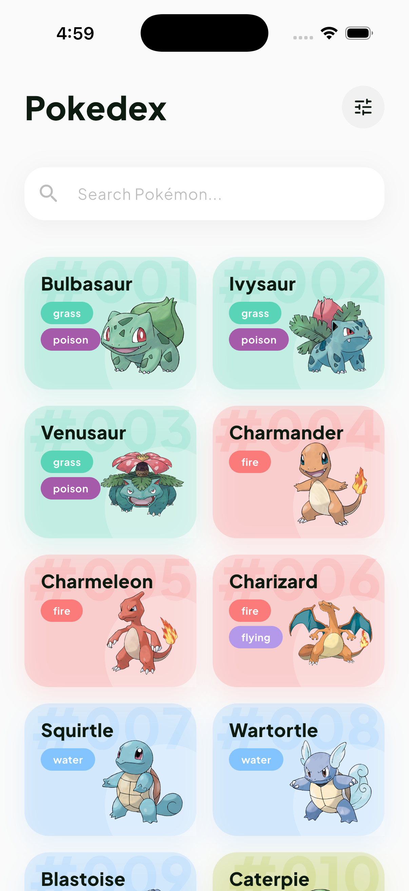
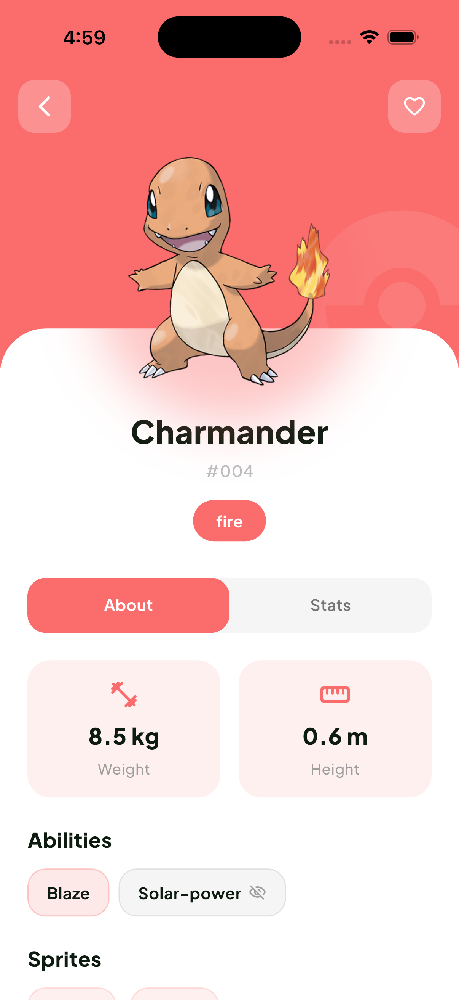
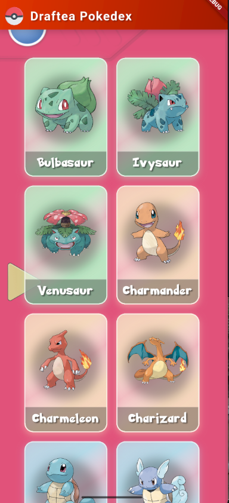
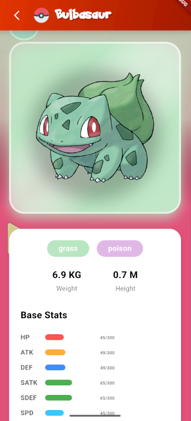

# Draftea Pokedex 📱

[Descargar última versión de Draftea Pokedex by Liam Marega](https://github.com/LiamMarega/draftea_pokedex/releases/tag/app-new-design)


---

## 🏗️ Cómo está organizado el código

Para que el proyecto sea escalable, me apoyé en **Clean Architecture**. La idea es que la lógica de negocio no dependa de si los datos vienen de una API o de una base de datos local, ni de cómo se ven los widgets.

```text
lib/
├── core/                  # Lo que usamos en toda la app (router, inyección de dependencias, diseño)
├── pokedex/               # Todo lo relacionado a la Pokedex específicamente
│   ├── data/              # Los modelos que vienen de la API y cómo los guardamos
│   ├── domain/            # El "corazón" de la app: qué es un Pokemon y qué acciones podemos hacer
│   └── ui/                # Lo que ve el usuario: pantallas, cubits y widgets
├── app.dart               # Configuración base de la aplicación
├── bootstrap.dart         # El arranque (logs, errores, inicialización de servicios)
└── main_*.dart            # Diferentes sabores (dev, production, staging)
```

---

## 🚀 Decisiones técnicas y por qué las tomé

### 1. Arquitectura y Web 🌐
**Clean Architecture** con **BLoC** para el estado. para que que la app sea una web súper compleja, toda la lógica del "Dominio" se queda igual. Solo tendríamos que retocar la capa de UI.

Para que la experiencia en **Web** use el paquete `responsive_grid_list` en la [Home Page](./lib/pokedex/ui/pages/pokedex_home.dart). Esto permite que la grilla de Pokemons se adapte segun el width de la pantalla.
Para la imagen de fondo de pantalla de la app se uso una original en resolucion vertical, y luego adapte la misma con ayuda de IA para tener la misma en formato horizontal y poder alternar dependiendo el width de la pantalla.

Además, se realizó un **rediseño moderno** de la interfaz con un enfoque en la simplicidad y fluidez visual, priorizando una experiencia de usuario intuitiva y atractiva.

### 2. Paquetes usados
En el [pubspec.yaml](./pubspec.yaml) vas a ver algunas dependencias clave:
*   **Hive**: Lo elegí para el almacenamiento local porque es increíblemente rápido y está hecho para Flutter. Ideal para guardar los datos de los Pokemons y que la app abra al instante.
*   **Dio**: Para las peticiones HTTP. Es mucho más potente que el `http` estándar, permitiendo interceptores (clave si después querés agregar auth o logs).
*   **Freezed**: Para los modelos de datos. Me ahorra escribir cientos de líneas de código repetitivo.
*   **GetIt + Injectable**: Para la inyección de dependencias. Esto hace que sea fácil cambiar una implementación.
*   **CachedNetworkImage**: Para que las fotos se guarden en caché.

### 3. Modo offline
Al entrar en modo offline la aplicacion lo detecta y muestra un cartel.
primero intentamos obtener los datos de la API para obtener datos actualiazdos, si no los obtenemos, obtenemos los datos de **Hive** guardados en cache anteriormente. 
Como generalmente los datos en esta api no cambian no implemente un sistema de expiración complejo.

### 4. Calidad🧼
*   **Inversión de dependencias**: No creo los objetos a mano dentro de las clases. Uso `GetIt` para que las piezas encajen solas.
*   **Responsabilidad única**: Los DataSources solo se encargan de hablar con internet, no mezclan lógica de si el Pokemon es de tipo agua o fuego.
*   **UI Declarativa**: Gracias a BLoC, la interfaz es una función del estado. Si el estado cambia, la UI se actualiza sola de forma predecible.

### 5. Trade-offs
Al tener poco tiempo, decidí enfocarme 100% en que la **UX sea fluida** que es mi fuerte y el código sea sólida.
 **Peticiones paralelas**: Hago una llamada para la lista y luego 20 paralelas para los detalles. Consume un poco más de datos al principio, pero la recompensa es ver los tipos y las imágenes de una sin esperar.

No terminé de implementar sistemas de búsquedas o filtros para enfocarme en que la UX sea fluida más estética y demostrar con información básica detalles del pokemon. **Nota importante**: Actualmente, ni los filtros ni el buscador en la página de inicio funcionan aún, están presentes únicamente como elementos de UI para futuras implementaciones.

Ademas obviamente para acelerar el proceso de desarrollo me apoye del uso de  **IA** para ayudarme a estructurar el proyecto, planificarlo y minimizar el boilerplate de codigo.


---

## 🛠️ Pendientes (Lo que agregaría después)
1.  **Animaciones**: Sumar efectos de entrada fluidos y animaciones al pasar el mouse (hovers) por las cartas en Web.
2.  **Búsqueda avanzada**: Filtros por tipos y parámetros de URL para poder compartir un link directo a un Pokemon.
3.  **DeepLinks**: Configurar el router y busquedas por **search params** para poder compartir links directos a pokemones.
4.  **Tests**: Aunque la arquitectura está lista para testear, agregarle tests unitarios a los Cubits y Repositorios sería el siguiente paso lógico.
5. **Offline images**: Las imagenes se cachean con la dependencia pero sin conexión no se muestran.

---

## 🚀 Cómo correr el proyecto

Antes de ejecutar el proyecto, es necesario preparar el entorno:

1. Generar los archivos de código generado:
```sh
dart run build_runner build
```

2. Instalar las dependencias:
```sh
dart pub get
```

Luego, ejecutá este comando para arrancar en modo desarrollo:
```sh
flutter run -t lib/main_development.dart --flavor development
```

Ejecutá este comando para arrancar en modo producción:
```sh
flutter run --t lib/main_production.dart --flavor production
```

---

## 📸 Screenshots

| Home Page | Details Page |
| :---: | :---: |
|  |  |

### OLD DESIGN

| Home Page | Details Page |
| :---: | :---: |
|  |  |


